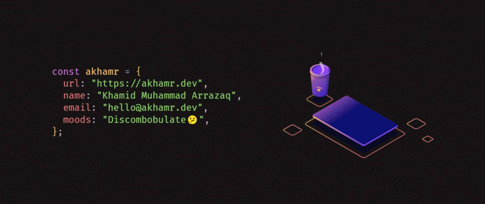

I'm a self-taught Full-stack Developer & Data Enthusiast from Indonesia 🇮🇩

### About me

- 📚 Generasi Gigih 2.0 by [YABB](https://www.anakbangsabisa.org/) & [GoTo](https://www.gotocompany.com/) as Data Analyst Track Participant.

- :brain: Certified Junior Web Programmer by [LSP TIK](https://lsptik.or.id/skema/detail/118-Junior-Web-Programmer.html) & Google Data Analyst by [Coursera](https://www.coursera.org/professional-certificates/google-data-analytics)

- 💬 Ask me about anything [here](https://github.com/akhamr/akhamr/issues).

- 📜 Also, you can read my [portfolio](https://akhamr.tech) & [resume](https://akhamr.tech/resume.pdf).

|  |  |
| - | - |

